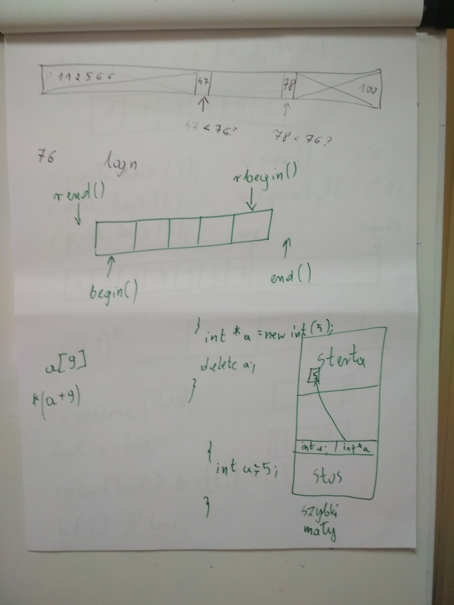
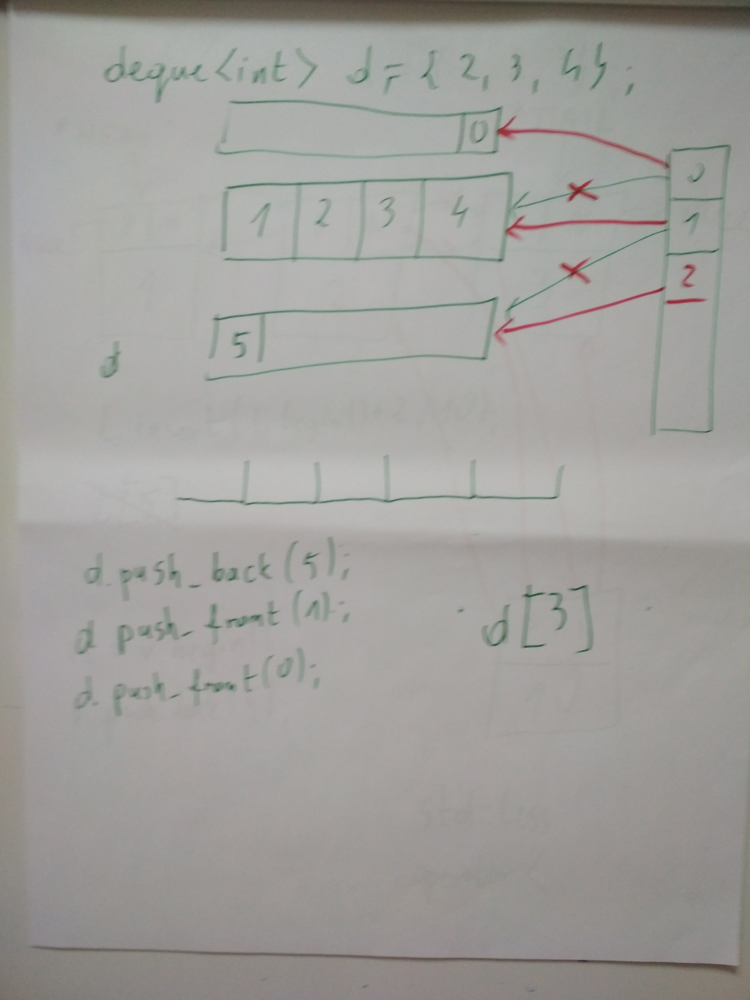
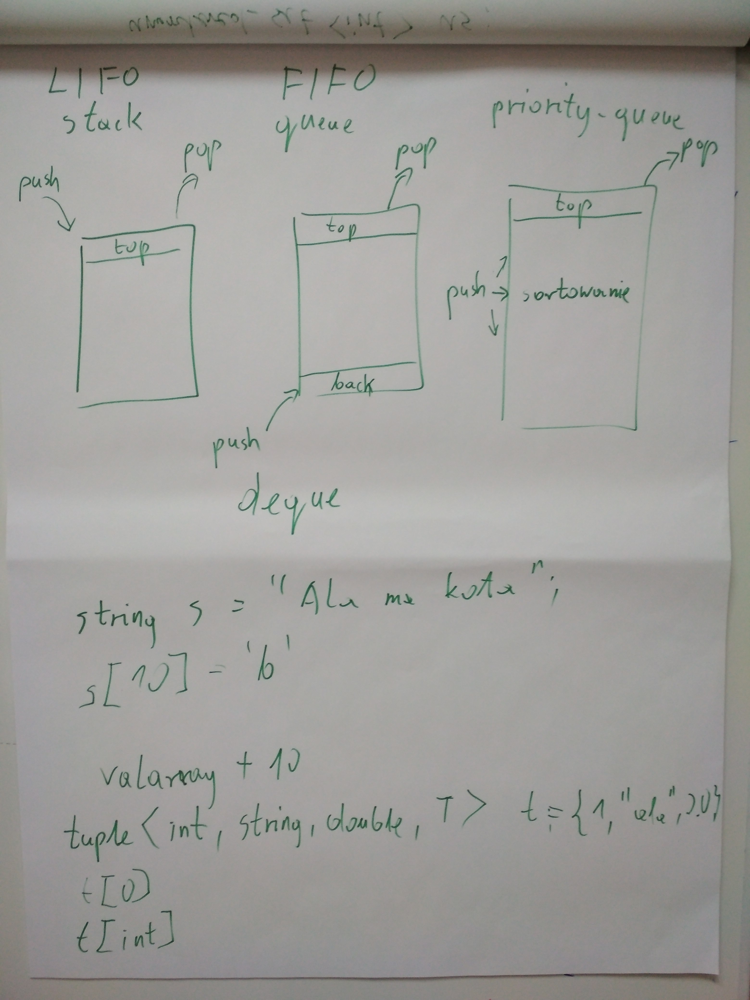
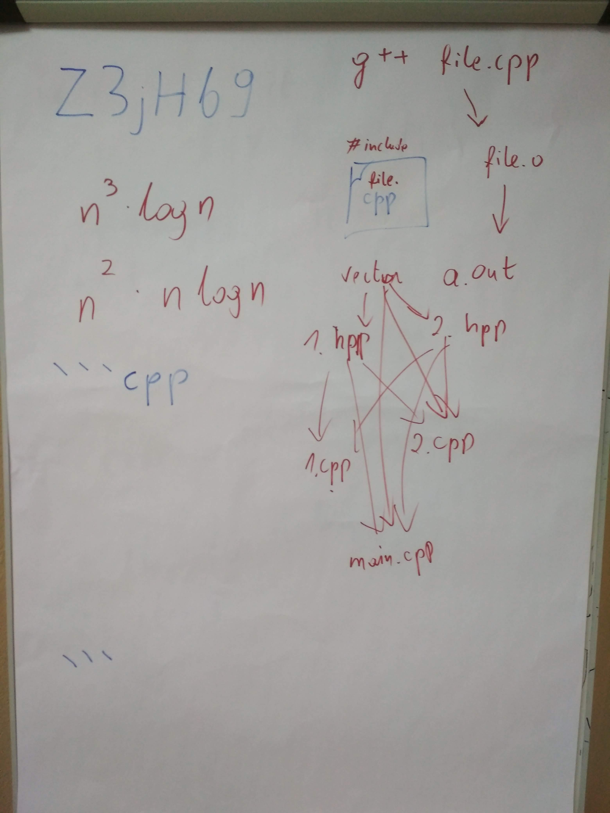
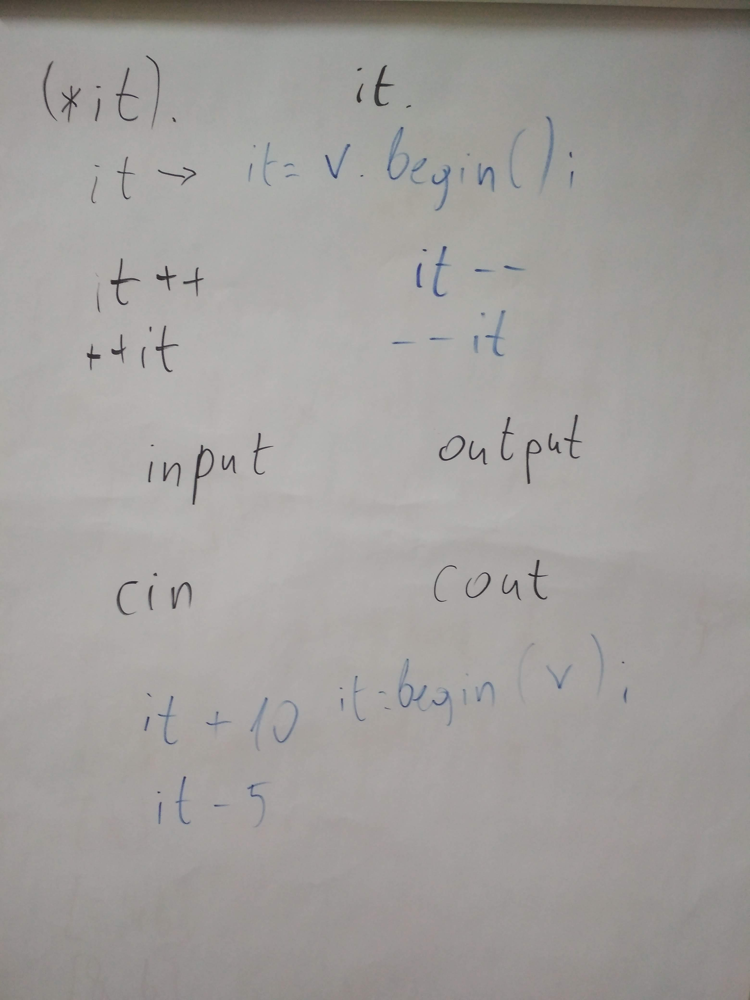
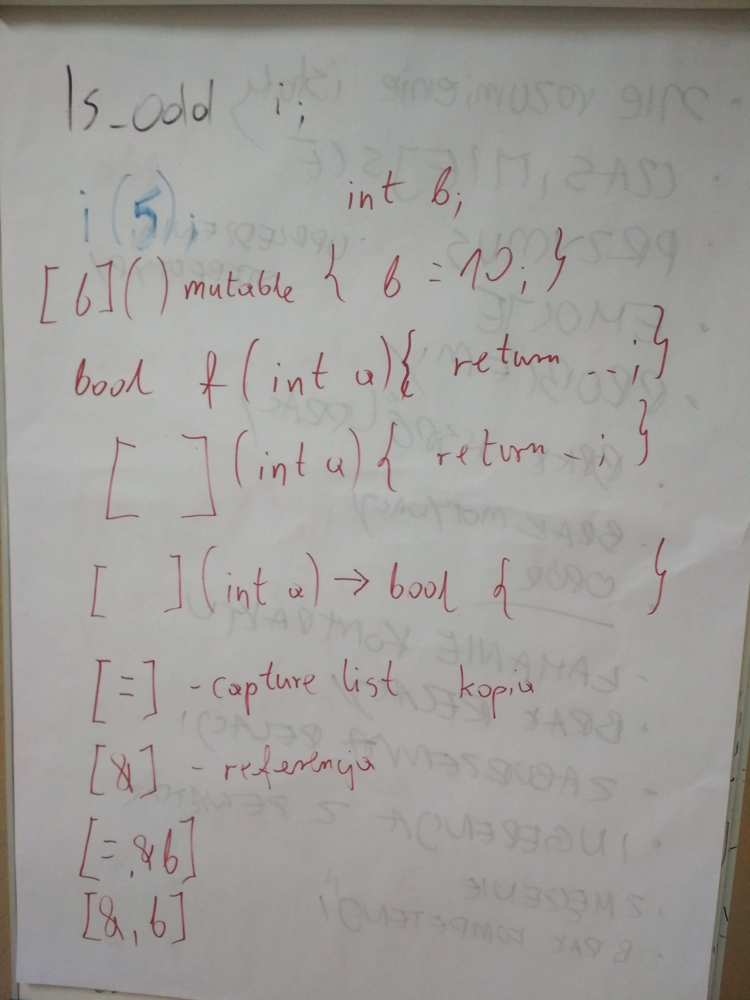
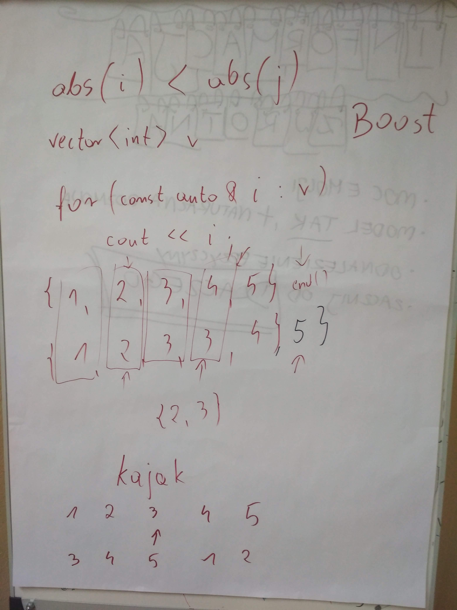

# Mini kurs C++ - Biblioteka STL i złożoność obliczeniowa
Materiały do kursu [Coders School](http://coders.school) (luty 2019)

## 02.02.2019 Kontenery

### Materiały z zajęć
- [Dokumentacja C++ (cppreference.com)](https://en.cppreference.com/)
- [Ściąga ze złożoności obliczeniowej](zlozonosc_obliczeniowa.pdf)
- [Prezentacja z zajęć o STL](STL.pdf)
- [Zadania z STLa](zadania_STL.pdf)
- [C++ Data Structures and Algorithms Cheat Sheet](https://github.com/gibsjose/cpp-cheat-sheet/blob/master/Data%20Structures%20and%20Algorithms.md)

### Praca domowa
- [ ] Zapoznaj się bardzo ogólnie z [dokumentacją C++ cppreference.com](http://en.cppreference.com/w/)
- [ ] Przeczytaj [artykuł mojego kolegi Marcina Pietraszka o złożoności obliczeniowej](http://www.samouczekprogramisty.pl/podstawy-zlozonosci-obliczeniowej/)
- [ ] Obejrzyj 2 filmy o złożoności obliczeniowej: [Big O Notation](https://www.youtube.com/watch?v=v4cd1O4zkGw), [What Is Big O? (Comparing Algorithms)](https://www.youtube.com/watch?v=MyeV2_tGqvw)
- [ ] Zapoznaj sie dokładniej z [opisem kontenerów na cppreference.com](http://en.cppreference.com/w/cpp/container)
- [ ] [Playlista na YT odnośnie STLa](https://www.youtube.com/playlist?list=PL5jc9xFGsL8G3y3ywuFSvOuNm3GjBwdkb) - obejrzyj ile możesz :)
- [ ] Zapoznaj się ze [ściągą o polimorfiźmie](polimorfizm.pdf). Może się to przydać w projekcie grupowym.

### Foto i nagranie
- [Nagranie na YouTube](https://www.youtube.com/watch?v=imoJsQ60GdY)
-  
   
   
   
  

## 09.02.2019 Iteratory, funktory, lambdy, algorytmy

### Materiały
- [Dokumentacja C++ (cppreference.com)](https://en.cppreference.com/)
- [Prezentacja z zajęć o STL](STL.pdf)
- [Zadania z STLa](zadania_STL.pdf)
- [Ściąga z funktorów i lambd](Funktory_i_lambdy.pdf)
- [Ściąga z iteratorów](iteratory.pdf)
- [Rozwiązania zadań z listy](https://github.com/LordLukin/stl)
- [Wstępny projekt StudentsDatabase](https://github.com/coders-school/Kurs-CPP/tree/master/L03-cpp-fundamentals/StudentsDatabase)

### Praca domowa
- [ ] [Playlista na YT odnośnie STLa](https://www.youtube.com/playlist?list=PL5jc9xFGsL8G3y3ywuFSvOuNm3GjBwdkb) - obejrzyj ile możesz :)
- [ ] Przejrzyj [iteratory na cppreference.com](https://en.cppreference.com/w/cpp/iterator)
- [ ] Przejrzyj [algorytmy na cppreference.com](https://en.cppreference.com/w/cpp/algorithm). Na pewno użyjesz kilku z nich w projekcie.
- [ ] Przypomnij sobie wszystkie kontenery oraz złożoności operacji na nich -  [C++ Data Structures and Algorithms Cheat Sheet](https://github.com/gibsjose/cpp-cheat-sheet/blob/master/Data%20Structures%20and%20Algorithms.md). Spróbuj pomapować nazwy tam użyte na ich odpowiedniki z STLa.

### Foto i nagranie
- [Nagranie na YouTube](https://www.youtube.com/watch?v=ucbKI9MGqgI)
-  
   

## 16.02.2019 Algorytmy, mini-projekt

### Materiały
- [Dokumentacja C++ (cppreference.com)](https://en.cppreference.com/)
- [Prezentacja z zajęć o STL](STL.pdf)
- [Zadania z STLa](zadania_STL.pdf)
    
### Praca domowa
  - [ ] Dokończ mini projekt z szyfrowania (zadanie 12A), jeśli nie udało Ci się go ukończyć na zajęciach
  - [ ] Opcjonalnie wykonaj drugi mini-projekt z generowaniem podzielników liczb (zadanie 12B)
  - [ ] [Wypełnij ankietę oceniającą mini kurs](https://goo.gl/forms/sMAJFvXkaz1rmYhc2)
  - [ ] **Test z STLa i złożoności obliczeniowej (termin do 02 marca 2019)**
  
  
## Projekt

Napisz program, który będzie akademicką "bazą danych".
**Wymagania do 09.02.2019:**
-   Przechowywanie rekordów studentów o strukturze: Imię, nazwisko, adres, nr indeksu
-   Dodawanie nowych studentów
-   Sortowanie po numerze PESEL
-   Usuwanie po numerze indeksu

**Wymagania do 16.02.2019:**
  - Przechowywanie rekordów studentów o strukturze: Imię, nazwisko, PESEL, płeć, adres, nr indeksu.
  - Wyszukiwanie po nazwisku
  - Wyszukiwanie po numerze PESEL
  - Wyswietlanie całej bazy danych
  - Sortowanie po PESELu
  - Sortowanie po nazwisku
  - Wypełnianie bazy danych sztucznymi danymi (generowanie danych)
  - Usuwanie po numerze PESEL
  - Modyfikacja adresu po numerze PESEL
  - _Walidacja czy numer PESEL jest poprawny [Wiki - poprawnosc PESEL](https://pl.wikipedia.org/wiki/PESEL#Cyfra_kontrolna_i_sprawdzanie_poprawno%C5%9Bci_numeru) (problematyczne)_
  - _Wczytywanie z pliku i zapisywanie całej bazy w pliku (problematyczne)_

**Wymagania dodatkowe:** (jeśli znasz polimorfizm)
  - Przechowywanie rekordów pracowników o strukturze: Imię, nazwisko, PESEL, płeć, adres, zarobki
  - Wszystkie osoby niezależnie czy będa to pracownicy czy studenci mają być trzymani w jednym kontenerze
  - _Modyfikacja zarobków po numerze PESEL (problematyczne)_
  - _Sortowanie po zarobkach (problematyczne)_

#### Pierwszy termin na dostarczenie podstawowych wymagań to 9 lutego. Do 16 lutego musisz udostępnić zaimplementowane pozostałe wymagania. Jeśli nie uda się dostarczyć wszystkiego na czas, to musisz pokazać to co udało się zrobić. Dopuszczalne jest, że niektóre rzeczy nie będą działać. Do 23 lutego masz czas, aby program dokończyć i poprawić według udzielonych wskazówek. Wszystko już musi wtedy działać. Do 2 marca z kolei musisz jeszcze dostarczyć finalną wersję, jeśli trzeba będzie jeszcze zastosować jakieś poprawki.

Możesz (a nawet to byłoby wskazane) kontaktować i konsultować się z innymi uczestnikami mini kursu. Projekt ten możecie też zrobić w grupach (max 3 osoby). W tym celu musicie jednak używać GitHuba do współpracy.

Pamiętaj! Po to jest biblioteka STL, aby wziąć z niej jak najwięcej. Postaraj się, aby w programie nie było żadnych pętli.

**UWAGA: Zwracaj uwagę na formatowanie kodu**. Powinno być jednolite, wszędzie powinny być odpowiednie wcięcia, a kod powinien być maksymalnie prosty i czytelny. W szczególności nie używaj tabów zamiast spacji, bo całe formatowanie się przez to rozjeżdża.

Jeśli utkniesz albo chcesz sprawdzić zgodność z wymaganiami to zajrzyj do [Checklisty](checklist.md)
